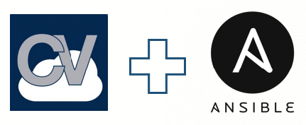

  

# Ansible Modules for Arista CloudVision Platform

<!-- @import "[TOC]" {cmd="toc" depthFrom=1 depthTo=6 orderedList=false} -->

<!-- code_chunk_output -->

- [Ansible Modules for Arista CloudVision Platform](#ansible-modules-for-arista-cloudvision-platform)
  - [About](#about)
  - [Modules overview](#modules-overview)
    - [Important notes.](#important-notes)
  - [Installation](#installation)
    - [Dependencies](#dependencies)
    - [Installation from ansible-galaxy](#installation-from-ansible-galaxy)
    - [Git installation](#git-installation)
    - [Git installation for testing](#git-installation-for-testing)
    - [Docker for testing](#docker-for-testing)
  - [Getting Started](#getting-started)
  - [Resources](#resources)
  - [License](#license)
  - [Ask a question](#ask-a-question)
  - [Contributing](#contributing)

<!-- /code_chunk_output -->

## About

[Arista Networks](https://www.arista.com/) supports Ansible for managing devices running the EOS operating system through [CloudVision platform (CVP)](https://www.arista.com/en/products/eos/eos-cloudvision). This roles includes a set of ansible modules that perform specific configuration tasks on CVP server. These tasks include: collecting facts, managing configlets, containers, build provisionning topology and running tasks. For installation, you can refer to [specific section](#git-installation) of this readme.

<p align="center">
  
</p>

More documentation is available in [project's wiki pages](https://github.com/aristanetworks/ansible-cvp/wiki)

## Modules overview

This repository provides content for Ansible's collection __arista.cvp__ with following content:

- [__arista.cvp.cv_facts__](docs/cv_facts.md) - Collect CVP facts from server like list of containers, devices, configlet and tasks.
- [__arista.cvp.cv_configlet__](docs/cv_configlet.md) -  Manage configlet configured on CVP.
- [__arista.cvp.cv_container__](docs/cv_container.md) -  Manage container topology and attach configlet and devices to containers.
- [__arista.cvp.cv_device__](docs/cv_device.md) - Manage devices configured on CVP
- [__arista.cvp.cv_task__](docs/cv_task.md) - Run tasks created on CVP.

This collection supports CVP version `2018.2.5` and `2019.1.x`

### Important notes.

This repository is built based on [new collections system](https://docs.ansible.com/ansible/devel/dev_guide/developing_collections.html#developing-collections) introduced by ansible starting version __2.9__. 

> It means that it is required to run at least ansible `2.9.0rc4` to be able to use this collection.

## Installation

### Dependencies

This collection requires the following to be installed on the Ansible control machine:


- python `2.7` (legacy) and `3.7`
- ansible >= `2.9.0`
- requests >= `2.22.0`
- treelib version `1.5.5` or later

### Installation from ansible-galaxy

Ansible galaxy hosts all stable version of this collection. Installation from ansible-galaxy is the most convenient approach for consuming `arista.cvp` content

```shell
$ ansible-galaxy collection install arista.cvp
Process install dependency map
Starting collection install process
Installing 'arista.cvp:1.0.1' to '~/.ansible/collections/ansible_collections/arista/cvp'
```

### Git installation

You can git clone this repository and use examples folder for testing. This folder contains a set of pre-configured playbook and ansible configuration:

__Clone repository__
```shell
$ git clone https://github.com/aristanetworks/ansible-cvp.git
$ cd ansible-cvp
```

__Build and install collection__

```shell
$ ansible-galaxy collection build --force ansible_collections/arista/cvp
$ ansible-galaxy collection install arista-cvp-<VERSION>.tar.gz
```

### Git installation for testing

You can git clone this repository and use examples folder for testing. This folder contains a set of pre-configured playbook and ansible configuration:

```shell
$ git clone https://github.com/aristanetworks/ansible-cvp.git
```

Update your ansible.cfg to update collections_paths to point to local repository

```ini
collections_paths = /path/to/local/repository:~/.ansible/collections:/usr/share/ansible/collections
```

> It is highly recommended to use a python virtual-environment to not alter your production environment.

### Docker for testing

The docker container approach for development can be used to ensure that everybody is using the same development environment while still being flexible enough to use the repo you are making changes in. You can inspect the Dockerfile to see what packages have been installed.

- Build Docker image

```shell
$ make build-docker
$ make run-docker
```

Image will be created using current branch as tag. If it is run in master branch, then latest git tag will be used as docker tag.


> Docker images can be reduced by using `--squash` option available with experimental features enabled on your docker host.

All files part of [`examples`](examples/) are copied into the container.


## Getting Started

This example outlines how to use `arista.cvp` to create a containers topology on Arista CloudVision.

A [complete end to end demo](https://github.com/titom73/ansible-avd-cloudvision-demo) using [Arista Validated Design collection](https://github.com/aristanetworks/ansible-avd) and CloudVision modules is available as an example. You can also find some playbook examples under [__`examples`__](examples/) folder with information about how to built a test environment.

Below is a very basic example to build a container topology on a CloudVision platform assuming you have 3 veos named `veos0{1,3}` and a configlet named `alias`

```yaml
---
- name: Playbook to demonstrate cv_container module.
  hosts: cvp
  connection: local
  gather_facts: no
  collections:
    - arista.cvp
  vars:
    containers_provision:
        Fabric:
          parent_container: Tenant
        Spines:
          parent_container: Fabric
        Leaves:
          parent_container: Fabric
          configlets:
              - alias
          devices:
            - veos03
        MLAG01:
          parent_container: Leaves
          devices:
            - veos01
            - veos02
  tasks:
    - name: "Gather CVP facts from {{inventory_hostname}}"
      cv_facts:
      register: cvp_facts

    - name: "Build Container topology on {{inventory_hostname}}"
      cv_container:
        topology: '{{containers_provision}}'
        cvp_facts: '{{cvp_facts.ansible_facts}}'
        save_topology: true
```

As modules of this collection are based on [`HTTPAPI` connection plugin](https://docs.ansible.com/ansible/latest/plugins/connection/httpapi.html), authentication elements shall be declared using this plugin mechanism and are automatically shared with `arista.cvp.cv_*` modules.

```ini
[development]
cvp_foster  ansible_host= 10.90.224.122 ansible_httpapi_host=10.90.224.122

[development:vars]
ansible_connection=httpapi
ansible_httpapi_use_ssl=True
ansible_httpapi_validate_certs=False
ansible_user=cvpadmin
ansible_password=ansible
ansible_network_os=eos
ansible_httpapi_port=443
```

As modules of this collection are based on [`HTTPAPI` connection plugin](https://docs.ansible.com/ansible/latest/plugins/connection/httpapi.html), authentication elements shall be declared using this plugin mechanism and are automatically shared with `arista.cvp.cv_*` modules.


## Resources

- Ansible for [Arista Validated Design](https://github.com/aristanetworks/ansible-avd)
- Ansible [EOS modules](https://docs.ansible.com/ansible/latest/modules/list_of_network_modules.html#eos) on ansible documentation.
- [CloudVision Platform](https://www.arista.com/en/products/eos/eos-cloudvision) overvierw
- Content for [demo using Arista Validated Design and `arista.cvp` collection.](https://github.com/titom73/ansible-avd-cloudvision-demo)

## License

Project is published under [Apache License](LICENSE).

## Ask a question

Support for this `arista.cvp` collection is provided by the community directly in this repository. Easiest way to get support is to open [an issue](https://github.com/aristanetworks/ansible-cvp/issues).

## Contributing

Contributing pull requests are gladly welcomed for this repository. If you are planning a big change, please start a discussion first to make sure we’ll be able to merge it.

You can also open an [issue](https://github.com/aristanetworks/ansible-cvp/issues) to report any problem or to submit enhancement.

A more complete [guide for contribution](contributing.md) is available in the repository

