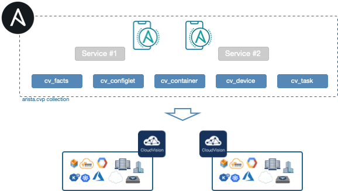

# Ansible Modules for Arista CloudVision Platform

> All the CV communication are now managed by [__cvprac library__](https://github.com/aristanetworks/cvprac). So a new [requirements](#dependencies) __MUST__ be installed first before any code execution.

## About

[Arista Networks](https://www.arista.com/) supports Ansible for managing devices running the EOS operating system through [CloudVision platform (CVP)](https://www.arista.com/en/products/eos/eos-cloudvision). This roles includes a set of ansible modules that perform specific configuration tasks on CVP server. These tasks include: collecting facts, managing configlets, containers, build provisionning topology and running tasks.

<p align="center">
  
</p>

## Requirements

__Arista CloudVision:__

- __CVP 2018.x.x__: starting version [`ansible-cvp 1.0.0`](https://github.com/aristanetworks/ansible-cvp/releases/tag/v1.0.0)
- __CVP 2019.x.x__: starting version [`ansible-cvp 1.0.0`](https://github.com/aristanetworks/ansible-cvp/releases/tag/v1.0.0)
- __CVP 2020.1.x__: starting version [`ansible-cvp 1.1.0`](https://github.com/aristanetworks/ansible-cvp/releases/tag/v1.1.0)
- __CVP 2020.2.x__: starting version [`ansible-cvp 2.0.0`](https://github.com/aristanetworks/ansible-cvp/releases/tag/v2.0.0)

__Python:__

- Python 3.x

__Additional Python Libraries required:__

- python `3.6` and higher
- ansible >= `2.9.0`
- [cvprac](https://github.com/aristanetworks/cvprac) version `1.0.4`
- requests >= `2.22.0`
- treelib `1.5.5`
- jsonschema `3.2.0`

__Supported Ansible Versions:__ ansible 2.9 or later

## Installation

```shell
pip install requests>=2.22.0
pip install treelib>=1.5.5
pip install cvprac==1.0.4
```

Ansible galaxy hosts all stable version of this collection. Installation from ansible-galaxy is the most convenient approach for consuming `arista.cvp` content

```shell
$ ansible-galaxy collection install arista.cvp
Process install dependency map
Starting collection install process
Installing 'arista.cvp:1.1.0' to '~/.ansible/collections/ansible_collections/arista/cvp'
```

Complete installation process is available on [repository website](docs/installation/requirements/)

## Modules overview

This repository provides content for Ansible's collection __arista.cvp__ with following content:

__List of available modules:__

- [__arista.cvp.cv_facts__](docs/modules/cv_facts.rst/) - Collect CVP facts from server like list of containers, devices, configlet and tasks.
- [__arista.cvp.cv_configlet__](docs/modules/cv_configlet.rst/) -  Manage configlet configured on CVP.
- [__arista.cvp.cv_container__](docs/modules/cv_container.rst/) -  Manage container topology and attach configlet and devices to containers.
- [__arista.cvp.cv_device__](docs/modules/cv_device.rst/) - Manage devices configured on CVP
- [__arista.cvp.cv_task__](docs/modules/cv_task.rst/) - Run tasks created on CVP.

__List of available roles:__

- [__arista.cvp.dhcp_configuration__](roles/dhcp_configuration/) - Configure DHCPD service on a Cloudvision server or any dhcpd service.
- [__arista.cvp.configlet_sync__](roles/configlets_sync/) - Synchronize configlets between multiple Cloudvision servers.

## Example

This example outlines how to use `arista.cvp` to create a containers topology on Arista CloudVision.

A dedicated repository is available for step by step examples on [ansible-cvp-toi](https://github.com/arista-netdevops-community/ansible-cvp-toi).

A [complete end to end demo](https://github.com/arista-netdevops-community/ansible-avd-cloudvision-demo) using [Arista Validated Design collection](https://github.com/aristanetworks/ansible-avd) and CloudVision modules is available as an example.

Below is a very basic example to build a container topology on a CloudVision platform assuming you have 3 veos named `veos0{1,3}` and a configlet named `alias`

```yaml
---
- name: Playbook to demonstrate cv_container module.
  hosts: cvp
  connection: local
  gather_facts: no
  collections:
    - arista.cvp
  vars:
    containers_provision:
        Fabric:
          parent_container: Tenant
        Spines:
          parent_container: Fabric
        Leaves:
          parent_container: Fabric
          configlets:
              - alias
          devices:
            - veos03
        MLAG01:
          parent_container: Leaves
          devices:
            - veos01
            - veos02
  tasks:
    - name: "Gather CVP facts from {{inventory_hostname}}"
      cv_facts:
      register: cvp_facts

    - name: "Build Container topology on {{inventory_hostname}}"
      cv_container:
        topology: '{{containers_provision}}'
        cvp_facts: '{{cvp_facts.ansible_facts}}'
```

As modules of this collection are based on [`HTTPAPI` connection plugin](https://docs.ansible.com/ansible/latest/plugins/httpapi.html), authentication elements shall be declared using this plugin mechanism and are automatically shared with `arista.cvp.cv_*` modules.

```ini
[development]
cvp_foster  ansible_host= 10.90.224.122 ansible_httpapi_host=10.90.224.122

[development:vars]
ansible_connection=httpapi
ansible_httpapi_use_ssl=True
ansible_httpapi_validate_certs=False
ansible_user=cvpadmin
ansible_password=ansible
ansible_network_os=eos
ansible_httpapi_port=443
```

As modules of this collection are based on [`HTTPAPI` connection plugin](https://docs.ansible.com/ansible/latest/plugins/connection/httpapi.html), authentication elements shall be declared using this plugin mechanism and are automatically shared with `arista.cvp.cv_*` modules.

## License

Project is published under [Apache License](LICENSE).

## Ask a question

Support for this `arista.cvp` collection is provided by the community directly in this repository. Easiest way to get support is to open [an issue](https://github.com/aristanetworks/ansible-cvp/issues).

## Contributing

Contributing pull requests are gladly welcomed for this repository. If you are planning a big change, please start a discussion first to make sure we'll be able to merge it.

You can also open an [issue](https://github.com/aristanetworks/ansible-cvp/issues) to report any problem or to submit enhancement.

A more complete [guide for contribution](https://www.avd.sh/en/latest/docs/contributing/) is available in the repository
