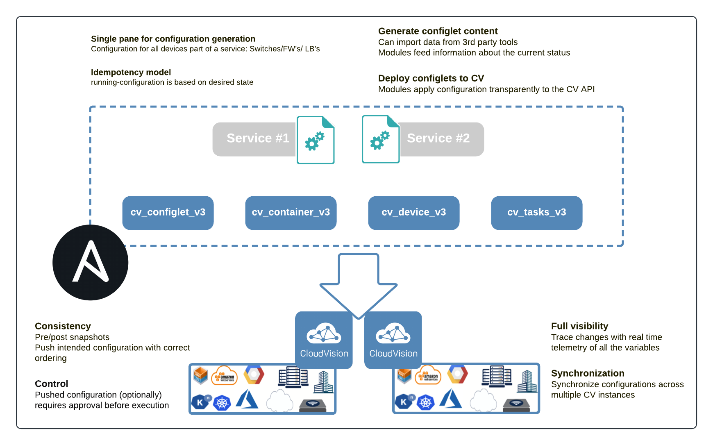

<!--
  ~ Copyright (c) 2023 Arista Networks, Inc.
  ~ Use of this source code is governed by the Apache License 2.0
  ~ that can be found in the LICENSE file.
  -->

# Ansible Modules for Arista CloudVision Platform

## About

[Arista Networks](https://www.arista.com/) supports Ansible for managing devices running the EOS operating system through [CloudVision platform (CVP)](https://www.arista.com/en/products/eos/eos-cloudvision). This collection includes a set of Ansible modules that perform specific configuration tasks on a CVP server. These tasks include collecting facts, managing configlets, building topology with containers and devices, and running tasks.

<p align="center">
  
</p>

Even if **`arista.cvp`** collection is integrated with `arista.avd` collection to [automate configuration deployment](https://avd.sh/en/latest/roles/eos_config_deploy_cvp/index.html), this collection can also be used outside of AVD tasks to populate your CloudVision server with your workflows.

## Requirements

### Arista CloudVision

Current active branch:

- **CVP 2021.3.x and onward**: starting with `ansible-cvp 3.9.0`

!!! info
    Starting with version 2.0.0, the collection uses [cvprac](https://github.com/aristanetworks/cvprac) as the CloudVision connection manager. So support for any new CloudVision server is tied to it's support in the cvprac Python library.

| ansible-cvp | 1.0.0 | 1.1.0 | >= 2.0.0 |>= 3.9.0 |
| ----------- | ----- | ----- | -------- | -------- |
| 2018.2 | ✅ | ✅ | ✅ | |
| 2019.x | ✅ | ✅ | ✅ | |
| 2020.1 | | ✅ | ✅ | |
| >= 2020.2 | | | ✅ | |
| >= 2021.3 | | | | ✅ |

### Python

- Python `>=3.9`

Please check the minimum version supported by your ansible installation on the [ansible website](https://docs.ansible.com/ansible/latest/installation_guide/intro_installation.html#control-node-requirements).

### Additional Python Libraries required

**Ansible version:**

- ansible-core>=2.14.0,<2.17.0

**3rd party Python libraries:**

- [cvprac](https://github.com/aristanetworks/cvprac)
- requests
- jsonschema
- treelib (for modules in version 1)

```shell
--8<-- "requirements.txt"
```

## Installation

```shell
pip install ansible_collections/arista/cvp/requirements.txt

# For modules in version 1
pip install treelib>=1.5.5
```

Ansible galaxy hosts all stable version of this collection. Installation from ansible-galaxy is the most convenient approach for consuming `arista.cvp` content

```shell
$ ansible-galaxy collection install arista.cvp
Process install dependency map
Starting collection install process
Installing 'arista.cvp:1.1.0' to '~/.ansible/collections/ansible_collections/arista/cvp'
```

Complete installation process is available on [repository website](docs/installation/requirements/)

## Collection overview

This repository provides content for Ansible's collection **arista.cvp** with following content:

### List of available modules

**Version 3:**

- [**arista.cvp.cv_configlet_v3**](docs/modules/cv_configlet_v3.md) -  Manage configlet configured on CVP.
- [**arista.cvp.cv_container_v3**](docs/modules/cv_container_v3.md) -  Manage container topology and attach configlet and devices to containers.
- [**arista.cvp.cv_device_v3**](docs/modules/cv_device_v3.md) - Manage devices configured on CVP
- [**arista.cvp.cv_task_v3**](docs/modules/cv_task_v3.md) - Run tasks created on CVP.
- [**arista.cvp.cv_facts_v3**](docs/modules/cv_facts_v3.md) - Collect information from CloudVision.
- [**arista.cvp.cv_image_v3**](docs/modules/cv_image_v3.md) - Create EOS images and bundles on CloudVision.
- [**arista.cvp.cv_tag_v3**](docs/modules/cv_tag_v3.md) - Create, delete, assign and unassign tags on CloudVision.
- [**arista.cvp.cv_validate_v3**](docs/modules/cv_validate_v3.md) - Configlet validation
- [**arista.cvp.cv_change_control_v3**](docs/modules/cv_change_control_v3.md) - Manage change controls on CloudVision.

### List of available roles

- [**arista.cvp.dhcp_configuration**](roles/dhcp_configuration/) - Configure DHCPD service on a CloudVision server or any dhcpd service.
- [**arista.cvp.configlet_sync**](roles/configlets_sync/) - Synchronize configlets between multiple CloudVision servers.

### Deprecated modules

- [**arista.cvp.cv_facts**](docs/modules/cv_facts.md) - Collect CVP facts from server like list of containers, devices, configlet and tasks.
- [**arista.cvp.cv_configlet**](docs/modules/cv_configlet.md) -  Manage configlet configured on CVP.
- [**arista.cvp.cv_container**](docs/modules/cv_container.md) -  Manage container topology and attach configlet and devices to containers.
- [**arista.cvp.cv_device**](docs/modules/cv_device.md) - Manage devices configured on CVP
- [**arista.cvp.cv_task**](docs/modules/cv_task.md) - Run tasks created on CVP.

## Example

This example outlines how to use `arista.cvp` to create a container's topology on Arista CloudVision.

A dedicated repository is available for step-by-step examples on [ansible-cvp-toi](https://github.com/arista-netdevops-community/ansible-cvp-toi).

A [complete end-to-end demo](https://github.com/arista-netdevops-community/ansible-avd-cloudvision-demo) using [Arista Validated Design collection](https://github.com/aristanetworks/ansible-avd) and CloudVision modules is available as an example.

Below is a very basic example of build a container topology on a CloudVision platform, assuming you have three vEOS named `veos0{1,3}` and a configlet named `alias`.

```yaml
---
- name: Playbook to demonstrate cvp modules.
  hosts: cv_server
  connection: local
  gather_facts: no
  collections:
    - arista.cvp
  vars:
    # Configlet definition
    device_configuration:
      mlag-01a-config: "{{lookup('file', './config-router-mlag01a.conf')}}"
      mlag-01b-config: "{{lookup('file', './config-router-mlag01b.conf')}}"

    # Container definition
    containers_provision:
        Fabric:
          parentContainerName: Tenant
        Spines:
          parentContainerName: Fabric
        Leaves:
          parentContainerName: Fabric
          configlets:
              - alias
        MLAG01:
          parentContainerName: Leaves

    # Device definition
    devices_provision:
      - fqdn: mlag-01a
        parentContainerName: 'MLAG01'
        configlets:
            - 'mlag-01a-config'
        systemMacAddress: '50:8d:00:e3:78:aa'
      - fqdn: mlag-01b
        parentContainerName: 'MLAG01'
        configlets:
            - 'mlag-01b-config'
        systemMacAddress: '50:8d:00:e3:78:bb'

  tasks:
    - name: "Build Container topology on {{inventory_hostname}}"
      arista.cvp.cv_container_v3:
        topology: '{{containers_provision}}'

    - name: "Configure devices on {{inventory_hostname}}"
      arista.cvp.cv_device_v3:
        devices: '{{devices_provision}}'
```

As modules of this collection are based on [`HTTPAPI` connection plugin](https://docs.ansible.com/ansible/latest/plugins/httpapi.html), authentication elements shall be declared using this plugin mechanism and are automatically shared with `arista.cvp.cv_*` modules.

```ini
[development]
cv_server  ansible_host= 10.90.224.122 ansible_httpapi_host=10.90.224.122

[development:vars]
ansible_connection=httpapi
ansible_httpapi_use_ssl=True
ansible_httpapi_validate_certs=False
ansible_user=cvpadmin
ansible_password=ansible
ansible_network_os=eos
ansible_httpapi_port=443
```

As modules of this collection are based on [`HTTPAPI` connection plugin](https://docs.ansible.com/ansible/latest/plugins/httpapi.html), authentication elements shall be declared using this plugin mechanism and are automatically shared with `arista.cvp.cv_*` modules.

## License

The project is published under [Apache License](LICENSE).

## Ask a question

To report a bug, discuss or request a specific feature, please open a [GitHub issue](https://github.com/aristanetworks/ansible-cvp/issues) using the appropriate template.

## Contributing

Contributing pull requests are gladly welcomed for this repository. If you are planning a significant change, please start a discussion first to ensure we can merge it.

You can also open an [issue](https://github.com/aristanetworks/ansible-cvp/issues) to report any problem or to submit enhancement.

A more complete [guide for contribution](https://avd.sh/en/latest/docs/contribution/overview.html) is available in the repository
