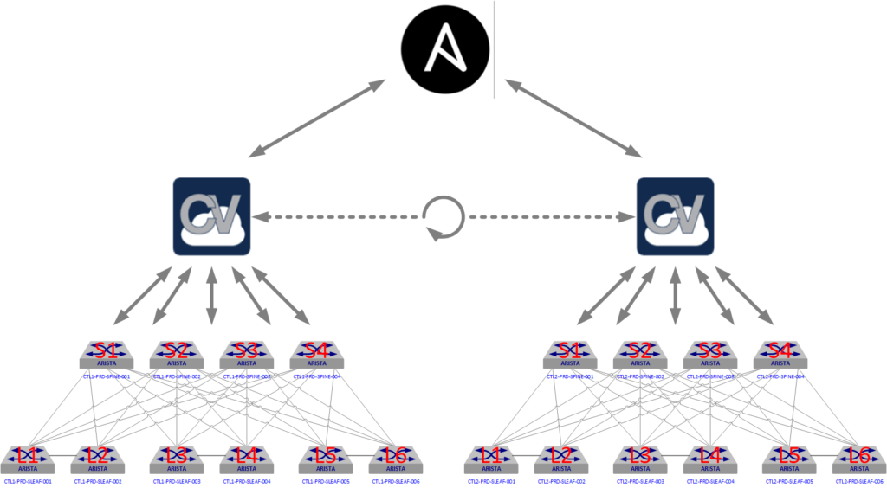

# configlet_sync role

Ansible role to synchronize configlets between 2 instances of [Cloudvision](https://www.arista.com/en/products/eos/eos-cloudvision) servers.

This role synchronize a designated set of CVP Configlets across multiple CVP instances. This ability to synchronize Configlets provides an efficient way of ensuring organizational policies and security requirements can be quickly deployed across an entire Arista estate in a consistent automated manner. The aim will be to deploy and synchronize a set of configlets that could be updated from any instance of CVP or via an Ansible PlayBook. This provides the most flexible method of managing the configlets without imposing any requirements to exclusively use either CVP or Ansible for updating them.



This role is implementation of example describe on [EOS Central blog](https://eos.arista.com/synchronising-cloudvision-portal-configlets-with-ansible/) by @Hugh-Adams.

## Requirements

No specific requirements to use this role.

## Tested Platforms

Any version of Cloudvision supported by current `arista.cvp` collection.

## Role Variables

### Mandatory variables

```yaml
---
action: < * action to run with the role: init|sync|pull|push>
```

- __`init`__: Create initial local folder to save role outputs.
- __`pull`__: Connects to each of the CVP instances, locates the configlets with `{{configlet_filter}}` in their name and updates local shared configlet data (config, last time changed, associated containers, associated devices) for each CVP instance.
- __`pull`__: Connects to each of the CVP instances and updates the shared configlets on each one using the information provided by `pull` action.
- __`sync`__: Execute both __`pull`__ and __`push`__ actions.

#### Optional variables

#### Role variables

```yaml
configlet_filter:       < PREFIX of configlet to look for synchronization, Default is shared >
```

#### Local folders outputs

```yaml
---
cvpsync_data:           < Local folder where configlets_sync save data. Default is generated_vars/ >

common_configlets_dir:  < Folder for common configlets. Default is {{cvpsync_data}}/common_configlets/ >
cvp_servers_dir:        < Folder for common configlets. Default is {{cvpsync_data}}/common_configlets/ >
```

- __`common_configlets_dir`__: contains details of the configlets that are to be synchronized across the CVP instances.
- __`cvp_servers_dir`__:  contains details of which configlets are to be deployed to the CVP servers. This directory can be used by other PlayBooks to deploy configlets and provision devices.

## Dependencies

No dependency required for this role.

## Example Playbook

### Playbook

Below is a basic playbook running `arista.cvp.dhcp_configuration` role to only get shared configlets with `generic` string in the name.

```yaml
---
- name: Shared Configlets across CVP clusters
  hosts: cvp_sync
  serial: true
  gather_facts: no
  collections:
    - arista.cvp
  tasks:
    - name: 'Init Configlets Sync structure'
      import_role:
        name: configlets_sync
      vars:
        action: init
    - name: 'Sync Shared Configlets'
      import_role:
        name: configlets_sync
      vars:
        action: pull
        configlet_filter: 'generic'
```

Example playbook to to synchronize shared configlets with `generic` string in the name:

```yaml
---
- name: Shared Configlets across CVP clusters
  hosts: cvp_sync
  serial: true
  gather_facts: no
  collections:
    - arista.cvp
  tasks:
    - name: 'Init Configlets Sync structure'
      import_role:
        name: configlets_sync
      vars:
        configlet_filter: 'generic'
        action: sync
```

### Inventory

`{{inventory_name}}` for Cloudvision instances can be changed to match your own environement. Only group name `cvp_sync` must be the same in inventory and playbook.

```yaml
---
all:
  children:
    cvp_sync:
      hosts:
        cv_server1:
          ansible_host: 1.1.1.1.1
          ansible_user: ansible
          ansible_password: ansible
        cv_server2:
          ansible_host: 8.8.8.8
          ansible_user: arista
          ansible_password: arista
      vars:
        ansible_httpapi_host: '{{ ansible_host }}'
        ansible_connection: httpapi
        ansible_httpapi_use_ssl: true
        ansible_httpapi_validate_certs: false
        ansible_network_os: eos
        ansible_httpapi_port: 443
        # Optional - Configuration to get Virtual Env information
        ansible_python_interpreter: $(which python)
```

## License

Project is published under [Apache 2.0 License](../../../../../LICENSE)
